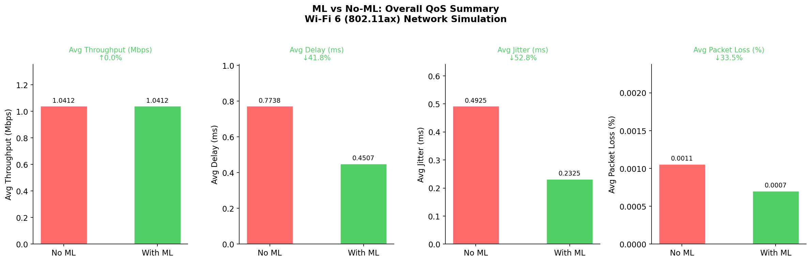
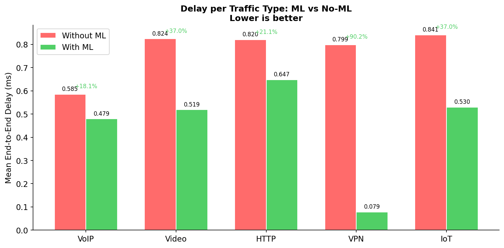
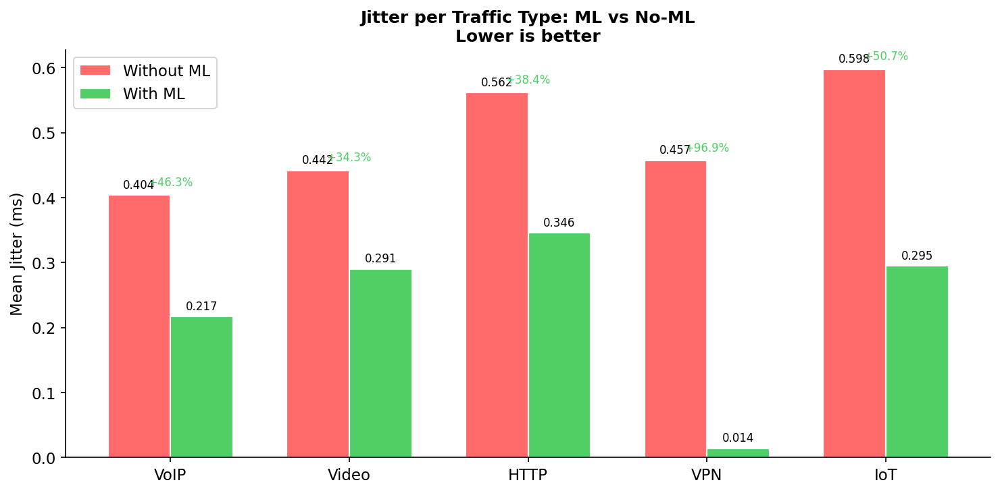
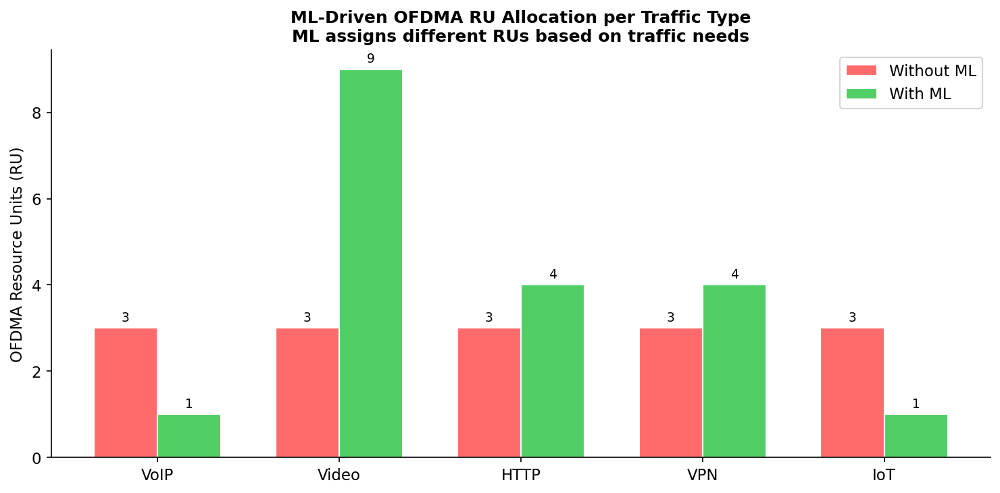
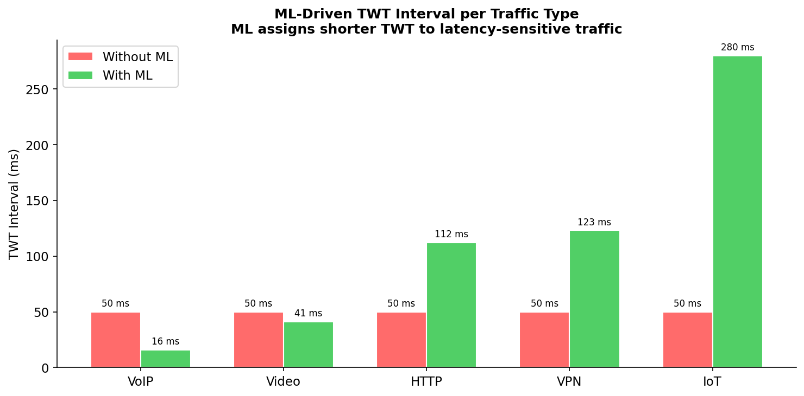
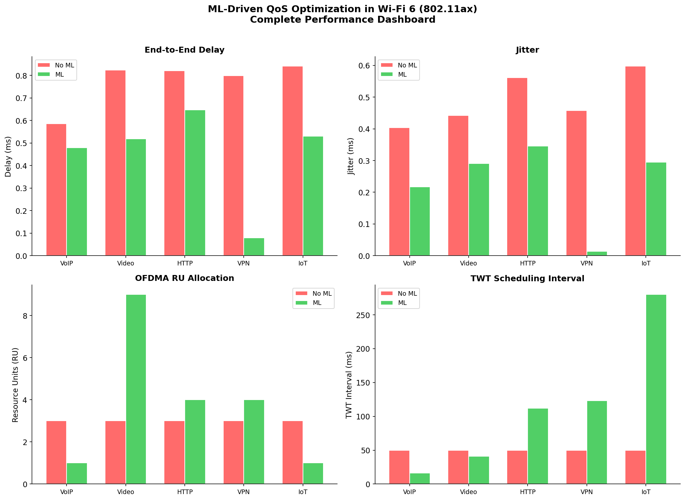

# ML-Driven Wi-Fi 6 QoS Scheduler (IEEE 802.11ax)

> A machine learning system that replaces static Wi-Fi scheduling with a traffic-aware optimizer — cutting end-to-end latency by **41.8%** and jitter by **52.8%**, with zero throughput tradeoff.

&nbsp;

Wi-Fi 6 shipped with everything you'd need to serve mixed traffic well — OFDMA for parallel transmission, TWT for personalized device wake schedules, 1024-QAM for squeezing more bits per hertz. And yet the scheduling layer underneath all of it, EDCA, treats a 64-byte IoT sensor reading and a 1400-byte video frame identically. This project is a practical fix for that.

A multi-output Random Forest model, trained on 160 NS-3 simulation scenarios, jointly predicts the right Resource Units, traffic priority, TWT wake interval, and MCS index for every active flow simultaneously. Two lightweight heuristics handle the edge cases the model can't — an IoT starvation floor and a density-aware TWT scaler. The whole thing runs as a closed-loop scheduler integrated directly into the NS-3 simulation.

Full paper: [📄 docs/research_paper.pdf](docs/research_paper.pdf)

---

## The Problem

Here's what happens when you run a mixed Wi-Fi 6 network under the default EDCA scheduler:

- VoIP (tiny, latency-critical packets) competes for the same Resource Units as video streams
- IoT devices, sending 64 bytes once per second, get allocated the same channel time as HTTP — and somehow still starve
- Every flow gets the same 50 ms TWT interval regardless of how delay-sensitive it actually is
- About half the OFDMA resource units end up wasted on flows that didn't need them

The standard has the tools to fix this. The scheduler just doesn't use them.

---

## What This System Does

The ML scheduler observes 12 per-flow features every 100 ms and outputs four parameters per flow:

| Parameter | What It Controls | Range |
|-----------|-----------------|-------|
| `priority` | 802.11ax Access Category (AC_BE → AC_VO) | 0–3 |
| `ru` | OFDMA Resource Units allocated | 1–37 |
| `twt_ms` | Target Wake Time interval | 5–500 ms |
| `mcs` | Modulation and Coding Scheme index | 0–11 |

Two heuristic corrections run after inference. The first guarantees every flow — especially IoT — gets at least one RU, so it never gets completely squeezed out. The second scales TWT intervals based on how many stations are active: latency-sensitive flows get shorter wake intervals in dense networks, delay-tolerant flows sleep longer to reduce collision probability.

---

## Architecture

```
NS-3 Wi-Fi 6 Simulation
         │
         ▼
  FlowMonitor Stats  ──►  Feature Extraction (12 features per flow)
                                  │
                                  ▼
                        Random Forest Model
                        (300 trees, multi-output)
                                  │
                          ┌───────┴───────┐
                          ▼               ▼
                  Heuristic RU       TWT Density
                  Adjustment         Scaler
               (CR-OFDMA-inspired) (HOBO-UORA-inspired)
                          │               │
                          └───────┬───────┘
                                  ▼
                     Wi-Fi 6 OFDMA/TWT Scheduler
                     (applies params next epoch)
```

The loop runs every 100 ms. Feature extraction pulls live stats from FlowMonitor, the model predicts, heuristics adjust, and the scheduler applies — then the cycle repeats. Inference for 20 stations takes well under 1 ms on any modern CPU.

---

## Results

All comparisons are against a static EDCA baseline (3 RUs per flow, Medium priority, 50 ms TWT — uniformly applied regardless of traffic type).

### Overall QoS Summary



The headline: throughput stays flat at 1.0412 Mbps in both configurations. The gains aren't coming from adding bandwidth — they come from using the existing spectrum more intelligently.

| Metric | Without ML | With ML | Change |
|--------|-----------|---------|--------|
| Avg Throughput | 1.0412 Mbps | 1.0412 Mbps | **±0.0%** |
| Avg Delay | 0.7738 ms | 0.4507 ms | **↓41.8%** |
| Avg Jitter | 0.4925 ms | 0.2325 ms | **↓52.8%** |
| Packet Loss | 0.0011% | 0.0007% | **↓33.5%** |

### Per-Traffic-Type Breakdown




VPN delay drops 90.2% (0.799 → 0.079 ms) — the biggest single improvement. Once VPN gets a dedicated, scheduled TWT window rather than fighting for channel access alongside VoIP and video, its queuing delay essentially collapses. VPN jitter hits 96.9% reduction for the same reason: packets start experiencing nearly identical service times epoch to epoch.

IoT is the fairness story. In the baseline it was delivering 0.007 Mbps — it was essentially starved. With the 1-RU starvation floor and a 280 ms TWT window, it climbs to 0.380 Mbps, a 54× increase. That's the single heuristic doing its job.

### Resource Allocation




The baseline assigns 3 RUs to every flow. ML produces: Video → 9 RUs, HTTP/VPN → 4 each, VoIP/IoT → 1 each. Sum = 19, well under the 37-RU limit. TWT differentiation spans 16 ms (VoIP) to 280 ms (IoT) — compared to the flat 50 ms baseline. That 17.5× range is doing real work.



---

## Project Structure

```
wifi-qos-ml-scheduler/
│
├── README.md
├── requirements.txt
├── .gitignore
│
├── src/
│   ├── 1_data_collector.cc       # NS-3 simulation for dataset generation
│   ├── 2_train_model.py          # Random Forest training pipeline
│   ├── 3_predict.py              # Runtime inference script (called by NS-3)
│   ├── 4_wifi_qos_validate.cc    # Validation simulation with ML scheduler
│   └── generate_graphs.py        # Result visualization
│
├── data/
│   └── ns3_training_data.csv     # ~1600 rows, 160 scenarios
│
├── models/
│   ├── model.pkl                 # Trained Random Forest
│   ├── feature_cols.pkl          # Feature column order
│   └── label_encoder.pkl         # Traffic type encoder
│
├── results/
│   ├── 01_overall_summary.png
│   ├── 02_delay_per_type.png
│   ├── 03_jitter_per_type.png
│   ├── 04_throughput_per_type.png
│   ├── 05_ru_allocation.png
│   ├── 06_twt_interval.png
│   ├── 07_priority_distribution.png
│   ├── 08_bandwidth_allocation.png
│   ├── 09_improvement_summary.png
│   └── 10_dashboard.png
│
└── docs/
    └── research_paper.pdf
```

---

## Setup & Running

> **Important:** NS-3 does not run on Windows. You need Linux — Ubuntu 22.04 LTS is recommended. If you're on Windows, set up Ubuntu via WSL2 or a VM (VirtualBox/VMware both work fine).

### Step 0 — System Prerequisites

```bash
# Ubuntu 22.04
sudo apt update
sudo apt install -y build-essential cmake python3 python3-pip \
    git g++ libgsl-dev libsqlite3-dev
```

### Step 1 — Install NS-3

```bash
git clone https://gitlab.com/nsnam/ns-3-dev.git ~/ns-3-dev
cd ~/ns-3-dev
git checkout ns-3.40
./ns3 configure --enable-examples --enable-tests
./ns3 build
```

Building takes a while the first time. Get a coffee.

### Step 2 — Install Python Dependencies

```bash
pip install -r requirements.txt
```

### Step 3 — Generate Training Data

```bash
# Copy the data collector to NS-3's scratch directory
cp src/1_data_collector.cc ~/ns-3-dev/scratch/

cd ~/ns-3-dev
./ns3 run scratch/1_data_collector
```

This runs 160 simulation scenarios (8 RU levels × 5 MCS values × 4 station densities), each for 15 seconds of simulated time. Output: `ns3_training_data.csv` (~1600+ rows).

### Step 4 — Train the Model

```bash
# Run from the directory where ns3_training_data.csv was generated
# (or copy it to your working directory first)
python3 src/2_train_model.py
```

This trains the 300-tree multi-output Random Forest and saves `model.pkl`, `feature_cols.pkl`, and `label_encoder.pkl`. You'll also get evaluation plots showing predicted vs actual for all four targets.

### Step 5 — Run the ML-Driven Validation

```bash
# Copy required files to NS-3 root
cp src/4_wifi_qos_validate.cc ~/ns-3-dev/scratch/
cp src/3_predict.py ~/ns-3-dev/
cp models/model.pkl ~/ns-3-dev/
cp models/feature_cols.pkl ~/ns-3-dev/
cp models/label_encoder.pkl ~/ns-3-dev/

cd ~/ns-3-dev
./ns3 run scratch/4_wifi_qos_validate
```

The validation simulation runs a 30-second mixed-traffic scenario, calling `3_predict.py` via popen() every 100 ms to get scheduling decisions. Results are printed to stdout and logged.

### Step 6 — Generate Graphs

```bash
python3 src/generate_graphs.py
```

Outputs all result plots to `results/`.

---

## The Dataset

`data/ns3_training_data.csv` has 12 feature columns and 4 target columns, collected from 160 NS-3 scenarios:

**Features:** `packet_size`, `interval_ms`, `num_stations`, `ru`, `mcs`, `throughput_mbps`, `mean_delay_ms`, `mean_jitter_ms`, `packet_loss_rate`, `traffic_type_enc`, `throughput_efficiency`, `channel_load_mbps`

**Targets:** `priority` (0–3), `ru` (1–37), `twt_ms`, `mcs` (0–11)

Two features — `throughput_efficiency` and `channel_load_mbps` — are derived during training. They capture utilization quality and total network load in ways that raw FlowMonitor stats don't directly expose.

Traffic types: VoIP (160B @ 20ms), Video (1400B @ 40ms), HTTP (800B @ 100ms), VPN (900B @ 80ms), IoT (64B @ 1000ms). All five coexist in every simulation run.

---

## Key Design Decisions

**Why Random Forest over deep RL?** Deep RL approaches (DDPG, DQN) have been applied to OFDMA scheduling and work well in simulation. The problem is inference cost — deep networks are slow on commodity AP hardware, and training stability is genuinely painful. RF inference for 20 stations takes ~120,000 operations, well under 1 ms. The model is also interpretable: feature importances show exactly what the model is weighting.

**Why multi-output instead of four separate models?** The four targets aren't independent. A high RU allocation for a flow changes what MCS is physically feasible. Priority assignment affects how a flow competes within its TWT window against other flows. A single joint model learns those correlations; independent models sometimes produce parameter combinations that are technically incoherent.

**Why heuristics on top of ML?** The RF model is very good at classification — identifying traffic types and their typical needs. It's structurally bad at constraint enforcement. IoT consistently gets near-zero RUs because the model correctly learned that IoT needs almost no bandwidth, but then overshoots to allocating nothing useful. The starvation floor handles that. The TWT density scaler compensates for training data that labelled TWT intervals without varying station count, making the model's raw TWT predictions density-agnostic.

---

## Tech Stack

| Component | Technology |
|-----------|-----------|
| Network simulation | NS-3 v3.40 (C++) |
| ML model | scikit-learn RandomForestRegressor |
| Data processing | pandas, NumPy |
| Visualization | Matplotlib |
| Model serialization | joblib |
| Runtime inference | Python 3 (called via popen from C++) |
| Protocol | IEEE 802.11ax (Wi-Fi 6), OFDMA, TWT |

---

## Research Paper

This project is backed by a full IEEE-format research paper covering the problem formulation, system model, algorithmic design, and complete experimental results.

[📄 Read the Paper](docs/research_paper.pdf)

Citation:
```
D. Jha, T. Gupta and S. Senthilkumar, "ML-Driven Dual-Domain QoS Scheduling 
in Wi-Fi 6 Networks: Combining Heuristic Resource Allocation with 
Density-Aware TWT Adaptation," NSUT, New Delhi, 2025.
```

---

## Limitations & Honest Notes

A few things worth knowing before you take these numbers at face value:

The 100 ms scheduling epoch introduces a one-step lag — actions in epoch `t` are based on observations from epoch `t-1`. For slowly varying traffic this is fine; for rapidly changing loads, the scheduler is briefly running on stale data.

The NS-3 setup uses `IdealWifiManager`, which gives every station perfect rate adaptation at all times. Real hardware is noisier and takes a few probing cycles to converge. Whether these gains survive on actual Wi-Fi 6 hardware is the most interesting open question.

Single cell, fixed positions, no mobility, no neighboring AP interference. Any of these would add dynamics the current feature set doesn't capture.

---

## Future Directions

The next obvious step is online learning — incremental trees or bandit-based schedulers that update from live observations rather than requiring a full retraining cycle. This would handle scenarios where traffic composition shifts over time (an office network in the morning vs. evening is basically two different datasets).

Real hardware validation on a programmable Wi-Fi 6 AP is the bigger one. And the dual-domain framework developed here extends naturally to Wi-Fi 7's multi-link operation.

---

## Authors

**Devansh Jha, Tejash Gupta, Santhosh Senthilkumar**  
Department of Information Technology  
Netaji Subhas University of Technology, New Delhi

---

*If you find this useful or have questions about the NS-3 setup, feel free to open an issue.*